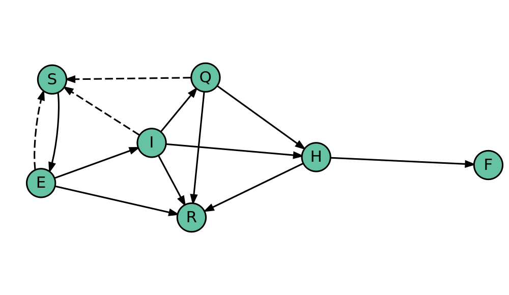

\chapter{Introdução}

O avanço de epidemias em populações fechadas é um problema que pode ser 
modelado como um processo Markoviano temporal com um número finito de estados, 
também chamados de compartimentos \cite{kendall}. 
As estimativas fornecidas por esses modelos sob o efeito de diferentes 
intervenções informam a construção de políticas públicas eficientes no combate 
às doenças estudadas.

No último ano, muitos modelos foram propostos para estimar a propagação e 
os impactos da doença COVID-19, causada pelo vírus Sars-CoV-2. 
Alguns conjuntos de estados foram criados com o propósito de estimar os efeitos 
sociais e estruturais da pandemia \cite{sidarthe}.
Um desses conjuntos é o SEIQHRF 
(Susceptible-Exposed-Quarantined-Hospitalized-Recovered-Fatality) 
\cite{churches}.  

Na UFMG, o projeto *COVID-19: proposta de um modelo epidemiológico que 
incorpora estruturas sociais de contágio* tem mapeado o grafo de relações 
pessoais do Aglomerado da Serra em Belo Horizonte, com o objetivo de modelar a 
progressão da COVID-19 em contextos de aglomerações urbanas. Esse projeto 
motivou a implementação de modelos de redes utilizando os estados SEIQHRF 
nesta monografia.

\chapter{Metodologia}

Neste capítulo, descreveremos modelos epidemiológicos, ...

\section{Epidemiologia}

\subsection{Modelos compartimentais}

A maior parte dos modelos epidemiológicos é baseado na compartimentalização de 
indivíduos de acordo com seus respectivos estados da doença \cite{keeling2005}. 
Esses modelos descrevem a proporção de indivíduos de uma população em cada 
estado ao longo do tempo. 
O modelo $SIR$, ilustrado na Figura \@ref(fig:sir-plot), tem três estados:

* **Susceptible**: suscetíveis. Esses indivíduos podem entrar em 
contato com infectados e prosseguir para o estado infectado;
* **Infected**: infectados. Podem entrar em contato com suscetíveis e 
infectá-los, ou prosseguir para o estado recuperado;
* **Recovered**: recuperados.


O SIR é adequado para doenças infecciosas que conferem imunidade vitalícia, 
como caxumba.
Sem dinâmicas vitais (processos naturais de nascimento e morte) e com uma 
população com mistura homogênea (na qual os indivíduos têm probabilidades 
idênticas de se encontrarem), 
o $SIR$ pode ser expressado pelo seguinte conjunto de equações diferenciais 
\cite{keeling2005}:

$$
\begin{aligned}
\diff{S}{t} &= -\beta SI \\
\diff{I}{t} &= \beta SI - \gamma I \\
\diff{R}{t} &= \gamma I
\end{aligned}
$$

Onde $\beta$ é...pode ser um vetor para expressar diferentes subpopulações...
$\gamma$ é...

Esses modelos podem não possuem soluções analíticas exatas,
e podem ser ajustados de forma determinística (aproximada) ou estocástica
\cite{infectiousdisases}.

A Figura \@ref(fig:compartment-plot)...usando o pacote `EpiModel` 
\cite{epimodel}... DCM e ICM.


\subsection{Modelos em redes}

Muitas vezes, temos conhecimento de relações entre indivíduos, 
que condicionam as probabilidades de contato entre os pares. 
Modelos em redes...

Não há soluções analíticas para essa classe de modelos, que são 
ajustados numericamente por meio de algoritmos de Markov Chain Monte Carlo 
\cite{missing}...

Um exemplo de simulação na Figura...

... \cite{stochasticepidemic}


\section{SEIQHRD}

Muitos conjuntos de estados foram propostos SIDARTHE \cite{giordano2020}...

O SEIQHRF \cite{churches}, ilustrado na Figura \@ref(fig:seiqhrf-plot), 
adiciona quatro estados ao SIR:

* **Exposed**: infectado e assintomático. Pode infectar o suscetível;
* **Quarantined**: infectado e sintomático. Pode infectar o suscetível, 
  com menor probabilidade de encontro que os demais estados infectados;
* **Hospitalized**: infectado e sintomático.
  Não encontra suscetíveis e tem maior probabilidade de morte;
* **Fatality**: morte.



\section{Grafos aleatórios}

Formalmente, um grafo aleatório $Y \in \mathcal{Y}$ 
consiste em um conjunto de $n$ vértices e $m$ arestas 
$\{Y_{{ij}}:i=1,\dots ,n;j=1,\dots ,n\}$,
no qual $Y_{ij} = 1$ se os vértices $(i,j)$ são conectados e
$Y_{ij} = 0$ caso contrário.

\subsection{Exponential random graph models}

Exponential random graph models (ERGMs) são modelos da família exponencial que 
descrevem grafos aleatórios.
Um ERGM é definido como:

$$
{\displaystyle P(Y=y | \theta) = 
{\frac {\exp(\theta ^{T}s(y))}{c(\theta )}}
,\quad \forall y\in {\mathcal {Y}}}
$$

onde $\theta$ é um vetor de parâmetros, 
$s(y)$ é um vetor de estatísticas suficientes e 
$c(\theta)$ é uma constante normalizadora.
As estatísticas suficientes podem ser funções da rede, ou de
atributos dos vértices.

ERGMs são utilizados na modelagem de redes sociais \cite{ergmsn}.

\chapter{Implementação}

O objetivo principal deste trabalho é implementar o conjunto de estados
em um network model, utilizando a linguagem de programação R \cite{r} e 
os pacotes `ergm` \cite{ergm} (para o ajuste e simulação dos grafos) e 
`EpiModel` \cite{epimodel} (para as simulacoes epidemiologicas via MCMC). 

O uso do `ergm` para o ajuste do ERGM eh trivial, e nao sera detalhado 
nesta secao. Contudo, a implementacao do SEQIHRF no `EpiModel` envolveu a 
programacao de algumas funcoes customizadas, descrevendo o processo gerador 
dos dados do modelo em questao. Esses modelos... \cite{epimodel-gallery}

\section{netsim}

Os modelos epidemiologicos em redes do `EpiModel` sao estimados via MCMC, 
por meio da funcao principal `netsim`. 
funcionam por meio de duas 
funcoes principais: `infect` e `progress`.

Simplificadamente, a funcao eh...

\section{Parametros}

\section{Infect}

\section{Progress}

\chapter{Simulação}

Neste capítulo, primeiro ajustaremos um ERGM.

Depois, simularemos cenários de progressão da COVID-19 em nosso grafo. 
Fixaremos estimativas calculadas por estudos recentes como parâmetros de 
infecção e progressão da doença.
Para os parâmetros de progressão para o estado *Quarantined*, bem como...

Compararemos inferencias...

\section{Síntese dos dados}

O pacote `ergm` \cite{ergm} contém diversos exemplos de grafo,
entre eles o `faux.magnolia.high`. 
Este grafo é uma simulação de uma rede de amigos de uma escola do sul dos 
Estados Unidos. 
Os vertices representam alunos, e as arestas as amizades entre alunos.
Cada aluno três atributos: `Grade` (turma), `Race` (raça) e `Sex` (sexo).

A figura \@ref(fig:plot-magnolia) ilustra o grafo em questão.


A documentação do `ergm` contém detalhes sobre o modelo utilizado na simulação 
do `faux.magnolia.high`. 

> The data set is based upon a model fit to data from two school
> communities from the AddHealth Study, Wave I (Resnick et al., 1997).
> It was constructed as follows:
>
> The two schools in question (a junior and senior high school in the
> same community) were combined into a single network dataset.
> Students who did not take the AddHealth survey or who were not listed
> on the schools' student rosters were eliminated, then an undirected
> link was established between any two individuals who both named each
> other as a friend.  All missing race, grade, and sex values were
> replaced by a random draw with weights determined by the size of the
> attribute classes in the school.

A especificacao do modelo eh:


```
## magnolia ~ edges + nodematch("Grade", diff = T) + nodematch("Race", 
##     diff = T) + nodematch("Sex", diff = F) + absdiff("Grade") + 
##     gwesp(0.25, fixed = T)
```

Onde as estatisticas geradas pelas funcoes sao:

* `edges`: numero de arestas. Eh o tamanho do conjunto $\{(i, j)\}$;
* `nodematch(attr, diff = FALSE)`: homofilia uniforme. Eh o tamanho do 
  conjunto $\{(i, j) | atributo de i = atributo de j\}$;
* `nodematch(attr, diff = TRUE)`: homofilia diferencial. 
  Sao $p$ estatisticas da rede. $p$ eh o tamanho do conjunto $\{atributos\}$.
  A estatistica do atributo $k$ eh o tamanho do conjunto 
  $\{(i, j)\ | \text{atributo de i = atributo de j = valor de k}}$,
  onde o valor de $k$ eh o menor valor unico do atributo em questao;
* `absdiff(attr)`: diferenca absoluta. 
  Eh a estatistica $|\text{atributo}_i - \text{atributo}_j|$._
* `gwesp(decay, fixed)`: ...


```
## [[1]]
## [1] "edges"
## 
## [[2]]
## [1] "nodematch" "Grade"     "7"        
## 
## [[3]]
## [1] "nodematch" "Grade"     "8"        
## 
## [[4]]
## [1] "nodematch" "Grade"     "9"        
## 
## [[5]]
## [1] "nodematch" "Grade"     "10"       
## 
## [[6]]
## [1] "nodematch" "Grade"     "11"       
## 
## [[7]]
## [1] "nodematch" "Grade"     "12"       
## 
## [[8]]
## [1] "nodematch" "Race"      "Asian"    
## 
## [[9]]
## [1] "nodematch" "Race"      "Black"    
## 
## [[10]]
## [1] "nodematch" "Race"      "Hisp"     
## 
## [[11]]
## [1] "nodematch" "Race"      "NatAm"    
## 
## [[12]]
## [1] "nodematch" "Race"      "Other"    
## 
## [[13]]
## [1] "nodematch" "Race"      "White"    
## 
## [[14]]
## [1] "nodematch" "Sex"      
## 
## [[15]]
## [1] "absdiff" "Grade"  
## 
## [[16]]
## [1] "gwesp" "fixed" "0"     "25"
```

<table>
<caption>Coeficientes do ajuste Magnolia.</caption>
 <thead>
  <tr>
   <th style="text-align:left;">   </th>
   <th style="text-align:right;"> x </th>
  </tr>
 </thead>
<tbody>
  <tr>
   <td style="text-align:left;"> edges </td>
   <td style="text-align:right;"> -8.2737000 </td>
  </tr>
  <tr>
   <td style="text-align:left;"> nodematch.Grade.7 </td>
   <td style="text-align:right;"> 1.5034820 </td>
  </tr>
  <tr>
   <td style="text-align:left;"> nodematch.Grade.8 </td>
   <td style="text-align:right;"> 1.4178946 </td>
  </tr>
  <tr>
   <td style="text-align:left;"> nodematch.Grade.9 </td>
   <td style="text-align:right;"> 0.9573554 </td>
  </tr>
  <tr>
   <td style="text-align:left;"> nodematch.Grade.10 </td>
   <td style="text-align:right;"> 1.0578061 </td>
  </tr>
  <tr>
   <td style="text-align:left;"> nodematch.Grade.11 </td>
   <td style="text-align:right;"> 1.2007128 </td>
  </tr>
  <tr>
   <td style="text-align:left;"> nodematch.Grade.12 </td>
   <td style="text-align:right;"> 1.2902990 </td>
  </tr>
  <tr>
   <td style="text-align:left;"> nodematch.Race.Asian </td>
   <td style="text-align:right;"> 1.9554507 </td>
  </tr>
  <tr>
   <td style="text-align:left;"> nodematch.Race.Black </td>
   <td style="text-align:right;"> 1.3584130 </td>
  </tr>
  <tr>
   <td style="text-align:left;"> nodematch.Race.Hisp </td>
   <td style="text-align:right;"> 0.3607707 </td>
  </tr>
  <tr>
   <td style="text-align:left;"> nodematch.Race.NatAm </td>
   <td style="text-align:right;"> 3.4614739 </td>
  </tr>
  <tr>
   <td style="text-align:left;"> nodematch.Race.Other </td>
   <td style="text-align:right;"> -Inf </td>
  </tr>
  <tr>
   <td style="text-align:left;"> nodematch.Race.White </td>
   <td style="text-align:right;"> 0.8844512 </td>
  </tr>
  <tr>
   <td style="text-align:left;"> nodematch.Sex </td>
   <td style="text-align:right;"> 0.7289404 </td>
  </tr>
  <tr>
   <td style="text-align:left;"> absdiff.Grade </td>
   <td style="text-align:right;"> -0.9112207 </td>
  </tr>
  <tr>
   <td style="text-align:left;"> gwesp.fixed.0.25 </td>
   <td style="text-align:right;"> 1.8612583 </td>
  </tr>
</tbody>
</table>

Como nossa especificação do ERGM descreve perfeitamente o processo gerador dos 
dados, não é necessário que verifiquemos o ajuste do modelo criteriosamente.
A figura \@ref(fig:plot-magnolia-sim) mostra um exemplo de grafo simulado a 
partir do nosso ajuste. Eh visualmente notavel a similaridade estrutural das 
arestas, e tambem a similaridade entre as distribuicoes de atributos.


\section{Simulacoes epidemiologicas}

\subsection{Simulacao simples}

Simulacao simples e algumas visoes descritivas.

O pacote `EpiModel` \cite{epimodel} da ferramentas


```
## [1] NA
## 
## Network Diagnostics
## -----------------------
## - Simulating 2 networks
## - Calculating formation statistics
## - Calculating duration statistics
## - Calculating dissolution statistics
##  EpiModel Network Diagnostics
## =======================
## Diagnostic Method: Dynamic
## Simulations: 2
## Time Steps per Sim: 500
## 
## Formation Diagnostics
## ----------------------- 
##          Target Sim Mean Pct Diff Sim SD
## edges       150  142.144   -5.237  0.860
## isolates    240  252.691    5.288  1.557
## degree0      NA  252.691       NA  1.557
## degree1      NA  213.471       NA  1.266
## degree2      NA   30.886       NA  0.438
## degree3      NA    2.771       NA  0.154
## degree4      NA    0.173       NA  0.004
## degree5      NA    0.008       NA  0.011
## 
## Dissolution Diagnostics
## ----------------------- 
##                Target Sim Mean Pct Diff Sim SD
## Edge Duration    10.0    9.846   -1.541  0.123
## Pct Edges Diss    0.1    0.102    2.129  0.000
```

```
## Error in file(filename, "r", encoding = encoding): cannot open the connection
```


\subsection{Teste de hipoteses}

Teste de hipoteses com quarentena vs. sem quarentena.

\chapter{Resultados}

TODO...

\chapter{Conclusão}

TODO...

\postextual
\bibliography{bibliography}
\begin{apendicesenv}
\partapendices
\chapter{Código}
\end{apendicesenv}


```r
knitr::opts_chunk$set(
  echo = FALSE, 
  fig.align = "center",
  out.width = "67%",
  out.height = "67%",
  message = FALSE,
  warning = FALSE,
  cache = TRUE
)
COLORS <- RColorBrewer::brewer.pal(8, "Set2")
USE_CACHE <- TRUE
library(DiagrammeR)

plot_states <- function(states, edge_df) {
  set.seed(0)
  set <- paste(states, collapse = "")
  path <- file.path("images", paste0(set, ".png"))
  create_graph() |>
    add_node(
      label = states,
      node_aes = node_aes(
        color = "black",
        fillcolor = COLORS[1],
        fontcolor = "black",
        height = 0.25,
        width = 0.25
      )
    ) |>
    add_edge_df(edge_df) |>
    render_graph(layout = "fr")
}

states <- c("S", "I", "R")
ids <- seq_along(states)
names(ids) <- states
edge_df <- create_edge_df(
  from = ids[c("S", "I", "I")],
  to = ids[c("I", "R", "S")],
  style = c("solid", "solid", "dashed"),
  color = "black"
)
plot_states(states, edge_df)
library(EpiModel)
# set.seed(1995)

# Example from: http://statnet.org/tut/BasicICMs.html
param <- param.dcm(inf.prob = 0.2, act.rate = 0.8, rec.rate = 1/50,
                   a.rate = 1/100, ds.rate = 1/100, di.rate = 1/90, 
                   dr.rate = 1/100)
init <- init.dcm(s.num = 900, i.num = 100, r.num = 0)
control <- control.dcm(type = "SIR", nsteps = 300)
det <- dcm(param, init, control)

param <- param.icm(inf.prob = 0.2, act.rate = 0.8, rec.rate = 1/50,
                   a.rate = 1/100, ds.rate = 1/100, di.rate = 1/90,
                   dr.rate = 1/100)
init <- init.icm(s.num = 900, i.num = 100, r.num = 0)
control <- control.icm(type = "SIR", nsteps = 300, nsims = 10)
sim <- icm(param, init, control)

plot(
  det,
  alpha = 0.75, lwd = 4, 
  main = "Compartimentos (%)",
  ylab = "", xlab = "Tempo"
)
plot(
  sim,
  qnts = FALSE, sim.lines = FALSE, add = TRUE, 
  mean.lty = 2, legend = FALSE
)
states <- c("S", "E", "I", "Q", "H", "R", "F") 
ids <- seq_along(states)
names(ids) <- states
from <- c('E', 'E', 'I', 'I', 'I', 'Q', 'Q', 'H', 'H', 'S', 'E', 'I', 'Q')
to <- c('I', 'R', 'Q', 'H', 'R', 'H', 'R', 'R', 'F', 'E', 'S', 'S', 'S')
edge_df <- create_edge_df(
  from = ids[from], 
  to = ids[to],
  style = rep(c("solid", "dashed"), c(10, 3)),
  color = "black"
)
plot_states(states, edge_df)
library(ergm)
plot_magnolia <- function(network, vertex_size = 0) {
  set.seed(2)
  plot(
    network,
    vertex.cex = vertex_size,
    vertex.col = COLORS[get.node.attr(faux.magnolia.high, "Grade") - 5]
  ) 
}

data(faux.magnolia.high)
par(mar = rep(0, 4), mfrow = c(1, 2))
plot_magnolia(faux.magnolia.high, 0)
plot_magnolia(faux.magnolia.high, 1)
# TODO plot edge histogram and maybe something else, like attribute barplots
magnolia ~ 
  edges +
  nodematch("Grade", diff = T) + nodematch("Race", diff = T) +
  nodematch("Sex", diff = F) + absdiff("Grade") + gwesp(0.25, fixed = T)
library(EpiModel)

magnolia_path <- file.path("models", "magnolia.rds")
if (USE_CACHE && file.exists(magnolia_path)) {
  magnolia <- readRDS(magnolia_path)
} else {
  formation <- 
    ~
    edges +
    nodematch("Grade", diff = T) +
    nodematch("Race", diff = T) +
    nodematch("Sex", diff = F) +
    absdiff("Grade") +
    gwesp(0.25, fixed = T)
  coef_diss <- dissolution_coefs(dissolution = ~ offset(edges), duration = 50)
  coef_diss$coef.crude <- -Inf
  magnolia_fit <- ergm(
    faux.magnolia.high ~ 
      edges + nodematch("Grade", diff=T) + nodematch("Race", diff=T) +
      nodematch("Sex",diff=F) + absdiff("Grade") + gwesp(0.25,fixed=T),
    burnin = 10000, interval = 1000, MCMCsamplesize = 2500, maxit = 25,
    control = control.ergm(steplength = 0.25, MCMLE.maxit = 100)
  ) 
  magnolia <- netest(
    faux.magnolia.high,
    formation = formation, 
    target.stats = NULL,
    coef.diss = coef_diss,
    set.control.ergm = control.ergm(
      MCMC.burnin = 10000,
      MCMC.interval = 1000,
      MCMC.samplesize = 2500,
      MCMLE.steplength = 1,
      MCMLE.maxit = 1
    )
  )
  magnolia$fit <- magnolia_fit

  saveRDS(magnolia, magnolia_path)
}
library(kableExtra)
coefs <- coef(magnolia$fit)
strsplit(names(coefs), "[.]")
kbl(
  coef(magnolia$fit),
  caption = "Coeficientes do ajuste Magnolia.",
  booktabs = TRUE
)
magnolia_sim <- simulate(
  magnolia$fit,
  nsim = 1,
  burnin = 100000000,
  constraint = "ConstantEdges"
) 

par(mar = rep(0, 4), mfrow = c(1, 2))
plot_magnolia(magnolia_sim, 0)
plot_magnolia(magnolia_sim, 1)
# library(parallel)
# 
# n_cores <- detectCores()
# eff_cores <- if (n_cores > 4) 4 else n_cores
# dx <- netdx(
#   magnolia, 
#   nsims = eff_cores,
#   nsteps = 365,
#   # set.control.ergm = control.simulate.ergm(
#   #   MCMC.burnin = 1e5,
#   #   MCMC.interval = 1000,
#   #   MCMLE.maxit = 1000,
#   #   MCMLE.steplength = 1
#   # ),
#   ncores = eff_cores
# )
# plot(dx, plots.joined = FALSE, qnts.alpha = 0.8)
# Model parameters
# Possible infections in the SEIQHRF model
inf.pars <- data.frame(
  from = c('e', 'i', 'q'),
  to = c('s', 's', 's'),
  act.rate = c(10, 10, 2.5),
  inf.prob = c(0.02, 0.05, 0.02) 
)
inf.pars$final.prob <- 1 - (1 - inf.pars$inf.prob)^inf.pars$act.rate
# Possible progressions in the SEIQHRF model
prog.pars <- data.frame(
  from = c('e', 'e', 'i', 'i', 'i', 'q', 'q', 'h', 'h'),
  to =   c('i', 'r', 'q', 'h', 'r', 'h', 'r', 'r', 'f'),
  rate = c(1/10, 1/20, 1/30, 1/30, 1/20, 1/30, 1/20, 1/15, 1/50)
)
# Summary parameters
states <- c(inf.pars$from, inf.pars$to, prog.pars$from, prog.pars$to)
unique.states <- unique(states)
sum.pars <- with(
  prog.pars,
  list(
    num.names = paste(unique.states, "num", sep = "."),
    flow.names = paste0(from, to, ".flow"),
    prog.rates = tapply(rate, from, function(x) 1 - prod(1 - x)),
    next.states = tapply(to, from, list),
    next.probs = tapply(rate, from, function(x) list(x / sum(x))),
    infective.status = unique(inf.pars$from),
    infected.status = unique(from)
  )   
)
source("R/model.R")
source("R/module-fx.R")
```
